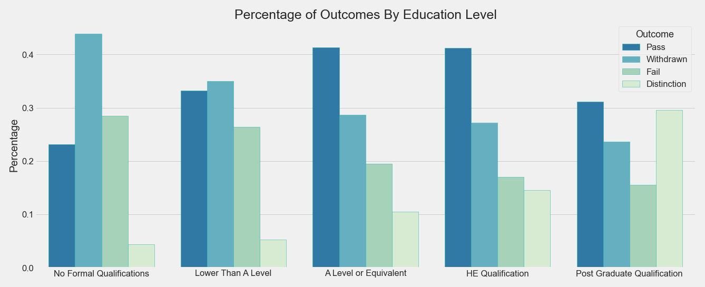

# Online Outcomes: Predicting Success in Virtual Learning


"Online Learning" by leanforward_photos is licensed under CC BY-SA 2.0

**Author:** Jeffrey Hanif Watson
***
### Quick Links
1. [Data Cleaning/EDA Notebook](./notebooks/exploratory/cleaning_eda.ipynb)
2. [Modeling Notebook](./notebooks/exploratory/modeling_eda.ipynb)
3. [Final Report](./notebooks/report/report.ipynb)
4. [Presentation Slides](./reports/presentation.pdf)
***
### Repository Structure

```
├── README.md
├── online_outcomes.yml
├── data
│   ├── processed
│   └── raw
├── models
├── notebooks
│   ├── exploratory
│   └── report
├── references
├── reports
│   └── figures
└── src
```
***
### Setup Instructions:

#### Create & Activate Environment
`cd` into the project folder and run `conda env create --file
online_outcomes.yml` in your terminal. Next, run `conda activate online_outcomes`.
***
## Overview:

***
## Business Understanding
 
***
## Data Understanding
Citation:
Kuzilek, J., Hlosta, M. & Zdrahal, Z. Open University Learning Analytics dataset. Sci Data 4, 170171 (2017). [Article](https://doi.org/10.1038/sdata.2017.171)

Download Page:
[Open University Learning Analytics dataset](https://analyse.kmi.open.ac.uk/open_dataset)

ERD & Data Details:
[Schema & Data Description](https://analyse.kmi.open.ac.uk/open_dataset#description)

***
## Data Preparation
Data cleaning details for the project can be found here:
[Data Cleaning/EDA Notebook](./notebooks/exploratory/cleaning_eda.ipynb)

***
# Exploring the  Data (Highlights From the EDA)
EDA for the project is detailed in the following notebook: [Data Cleaning/EDA Notebook](./notebooks/exploratory/cleaning_eda.ipynb)





***
# Modeling

Details of the full modeling process can be found here:
[Modeling Notebook](./notebooks/exploratory/modeling_eda.ipynb)


## Baseline Model:


<font size="4">Baseline Scores: F1 = 0, Recall = 0, Precision = 0</font>

#### Score Interpretation
F1 is a mix of both precision and recall, so the interpretation of the results is more easily given in terms of recall and precision. 

***
## First Simple Model:

<font size="4">Average Validation Scores: F1 = .49, Recall = .41, Precision = .62</font>


<font size="4">Scores on Test Data: F1 = .51, Recall = .43, Precision = .63</font>

### Score Interpretation
Since F1 is a mix of both precision and recall, the interpretation of the results is more easily described in terms of recall and precision. 

***
#### Feature Engineering & Intermediate Models

***
## Final Model:
<font size="4"> </font>

<font size="4">Average Scores: F1=, Recall=, Precision=</font>

[comment]: <> 

<font size="4">Scores on Test Data: F1=, Recall=, Precision=</font>

#### Score Interpretation


## Alternate Final Model:  
<font size="4"></font>

<font size="4">Average Scores: F1=, Recall=, Precision=</font>


[comment]: <>

<font size="4">Scores on Test Data: F1=, Recall=, Precision=</font>

#### Score Interpretation


#### Notes on the Features

## Conclusion & Recommendations

## Next Steps

## For More Information

Please review our full analysis in our [Jupyter Notebook](./notebooks/report/report.ipynb) or our [presentation](./reports/presentation.pdf).

For any additional questions, please contact **Jeffrey Hanif Watson jeffrey.h.watson@protonmail.com**
