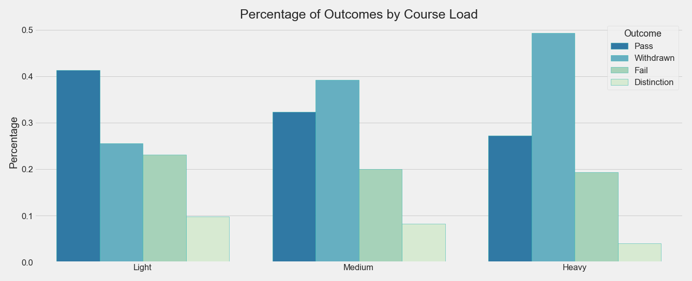
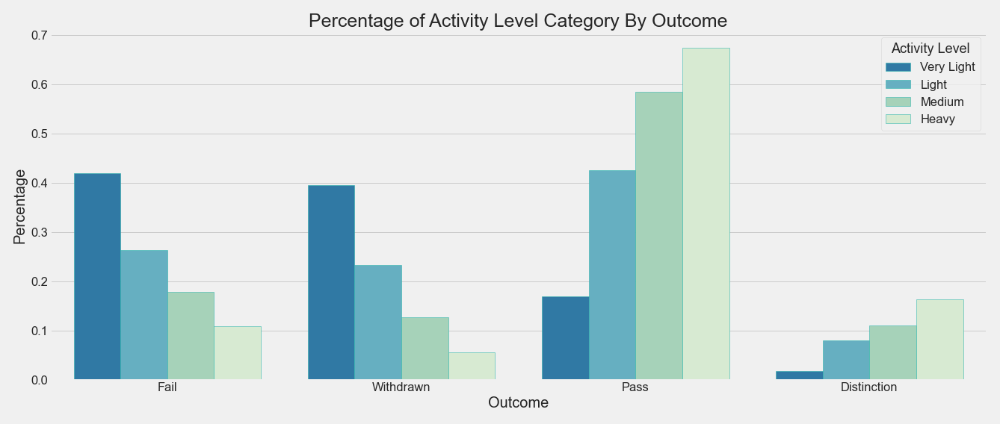
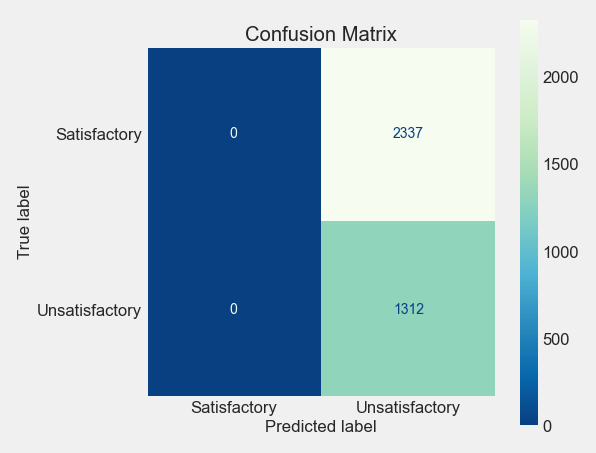
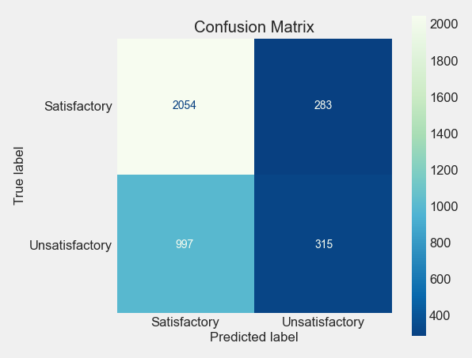
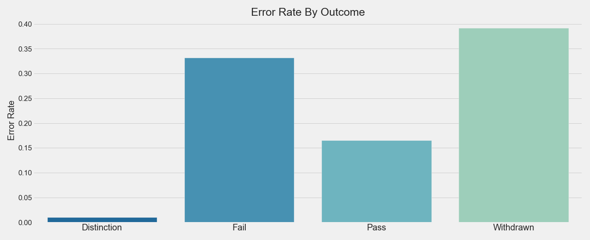

# Online Outcomes: Predicting Success in Virtual Learning


"Online Learning" by leanforward_photos is licensed under CC BY-SA 2.0

**Author:** Jeffrey Hanif Watson
***
### Quick Links
1. [Data Cleaning/EDA Notebook](./notebooks/exploratory/cleaning_eda.ipynb)
2. [Modeling Notebook](./notebooks/exploratory/modeling_eda.ipynb)
3. [Final Report](./notebooks/report/report.ipynb)
4. [Presentation Slides](./reports/presentation.pdf)
***
### Repository Structure

```
├── README.md
├── online_outcomes.yml
├── data
│   ├── processed
│   └── raw
├── models
├── notebooks
│   ├── exploratory
│   └── report
├── references
├── reports
│   └── figures
└── src
```
***
### Setup Instructions:

#### Create & Activate Environment
`cd` into the project folder and run `conda env create --file
oo.yml` in your terminal. Next, run `conda activate oo`.
***
## Business Understanding
In the years before the pandemic, online learning had been enjoying slow, reliable growth <sup>1</sup>, and was predicted to become a \$350 Billion global market by 2025.<sup>2</sup> Covid-19 has only accelerated this trend, with examples such as the online learning platform edX experiencing a 15-fold growth in registrations in April 2020<sup>3</sup>, and almost 93\% of school-age children engaged in online learning in 2020.<sup>4</sup> 

While the growth in online learning has provides opportunites, it has also raises concerns about student engagement, learning loss, and inequality. According to a recent NASPA Foundation survey, the main concern of over 70\% of college students is staying engaged with their online course materials<sup>5</sup>. The World Bank also reports that school closures and online learning have led to widespread learning loss across Europe and Central Asia<sup>6</sup>, and Harvard Professor Todd Rose notes that "Poor students and first-generation students often don’t do as well online."<sup>7</sup>

This project aimed to develop recommendations for strategies to avoid unsatisfactory outcomes in online learning environments and implement a model that can predict unfavorable outcomes in a timely manner so interventions can be applied to improve those outcomes.

## Overview
Since I wanted to avoid both false positives and false negatives (to capture the maximum number of at-risk students while still efficiently allocating resources) for this project, I chose an accuracy measure of F1,  because it is sensitive to both types of error. 

Data cleaning, EDA, modeling, and evaluation were performed, and a voting classifier model with an F1 accuracy score of 0.69 (recall=.65, precision=.72) was chosen as the final model for the project. An F1 score is a mix of both precision and recall (F1=1 means perfect recall and precision), so interpretation of the results is more easily described in terms of recall and precision. 

- The recall score of .65 meant that 65% of unsatisfactory outcomes were correctly classified as unsatisfactory.

- The precision score of .72 indicated that 72% of outcomes classified as unsatisfactory were truly unsatisfactory. 

Statistical testing was also employed to develop the following recommendations to help drive a higher level of satisfactory outcomes:

- Preemptive outreach and support programs should be implemented for non-traditional learners and lower income students, and inferential research should be conducted examining the advantages and disadvantages that socioeconomic status and education level confer in an academic setting to help refine those programs moving forward.

- Students should be advised to maintain modest course loads. Over half of the students with a heavy course load withdraw before the end of the course, and even a medium course load makes a withdrawal about as likely as a passing grade.

- Students should be counseled to maintain medium or higher online activity levels. Further, an automated reminder system that triggers when students fall below a predetermined level should be initiated, along with a web design assessment and A/B testing program, with the goal of driving up student engagement.

***
## Data Understanding

The data set for the project is the Open University Learning Analytics dataset.

The dataset was obtained as a compressed zip file containing 7 csv files of tabular data. After cleaning and EDA, the data was ultimately reduced to a modeling dataset of 19,458 rows and 14 columns (13 features plus the target).

Citation:
Kuzilek, J., Hlosta, M. & Zdrahal, Z. Open University Learning Analytics dataset. Sci Data 4, 170171 (2017). [Article](https://doi.org/10.1038/sdata.2017.171)

Download Page:
[Open University Learning Analytics dataset](https://analyse.kmi.open.ac.uk/open_dataset)

ERD & Data Details:
[Schema & Data Description](https://analyse.kmi.open.ac.uk/open_dataset#description)

***
## Data Preparation: SQL & Object Oriented Methods

SQL, data preparation and EDA experiments undertaken in the [Data Cleaning/EDA Notebook](./notebooks/exploratory/cleaning_eda.ipynb) were ultimately coded into data frame creation, data cleaning, and feature engineering OOP methods for a Database class. I did this work so the methods could be implemented on the fly to create various data configurations in the modeling, error analysis, and recommendations notebooks. The code located in the [class_Database.py](./src/class_Database.py) file. 

## Data Prepartion: Overview

The data was inserted into an SQL database, and a data frame was constructed from the various database tables. During the creation process, the multiclass `final_result` feature was binarized into a `target` feature with classes Satisfactory (Pass, Distinction), and Unsatisfactory (Withdrawn, Fail). A `row_id` feature was constructed to identify unique student-course-month combinations, and a `sum_activity` feature was added to quantify the level of a student's interaction with the course material. Lastly, `weighted_ave`, `mean_score`, and `median_score` were derived from each row's  assessment data.

After the data frame was created, various cosmetic fixes were applied to the data, and outliers were dropped from the `studied_credits`, `weighted_ave`, and `sum_activity` features using IQR fences. A categorical `course_load` feature was derived by binning `studied_credits`, and a categorical `activity_level` feature was created by binning `sum_activity`. The `course_load` feature was used during the modeling process, and `activity_level` was used for statistical testing when while investigating business recommendations. Lastly, null values and extraneous columns were dropped in preparation of the modeling process.

## Data Prepartion: Half-Term Data
In order to be able to predict unsatisfactory outcomes while there is still time to intervene, I limited the model to data logged up to the halfway of the courses. Since the median course length is 240 days, I  was chose a cutoff point of 120 days. Further, students who withdrew before the 120th day were dropped from the data, since their outcome was fully determined within the 120 day window.

Data preparation, EDA, and feature engineering experiments for the project can be found here:
[Data Cleaning/EDA Notebook](./notebooks/exploratory/cleaning_eda.ipynb)

***
# EDA & Recommendations
The siginificance level for all tests in the project is alpha=.05

EDA for the project is detailed in the following notebook: [Data Cleaning/EDA Notebook](./notebooks/exploratory/cleaning_eda.ipynb)

Recommendations for the project are detailed in the following notebook: [Recommendations Notebook](./notebooks/exploratory/recomendations.ipynb)

## Distribution of Final Results

For data spanning the full term, Pass and Withdrawn are the largest groupings 38\% and 32\% respectively, followed by Fail at almost 22\%. Distinction brings up the rear at 9\%.


| Outcome     | Percentage  |
| ----------- | ----------- |
| Pass        | 0.375770    |
| Withdrawn   | 0.315101    |
| Fail        | 0.219395    |
| Distinction | 0.089734    |
	 	
## Distribution of Satisfactory and Unsatisfactory Outcomes

The final results were binarized into Satisfactory (Pass, Distinction) and Unsatisfactory (Withdrawn, Fail). About 46\% of outcomes were satisfactory, and 53\% were unsatisfactory. 


| Outcome       | Percentage   |
| ------------- | -------------|
| Unsatisfactory| 0.531724     |
| Satisfactory  | 0.468276     |

## Outcomes by IMD Band
IMD Band is a measure of socioeconomic status that is based on geographic location. The higher the band, the better off the student is. 


A Chi-Squared test was performed, and it was found that IMD band and outcome are not independent (p value=2.473461324525511e-120). In general, Distinction and Pass vary directly with IMD band. The higher the student's IMD band, the more likely the student is to pass or pass with distinction. Conversely, Withdrawn and Fail vary inversely with IMD band. In general, the lower the student's IMD band the more likely the student is to fail or withdraw. 

**IMD band has a small, statistically significant effect student outcomes.** 

**V = 0.08360564396104112**

**Cramer's V Degrees of Freedom = 3**

## Outcome by Education Level
The rank of these UK education categories is as follows (from lowest to highest): No Formal Qualifications, Lower Than A Level, A Level, HE Qualification, Post Graduate Qualification.


A Chi-Squared test was performed, and it was found that education level and outcome are not independent (p value=2.4827414817328365e-198). In general, Distinction and Pass vary directly with education level. The higher the student's education level, the more likely the student is to pass or pass with distinction. Conversely, Withdrawn and Fail vary inversely with education. In general, the lower the student's education level the more likely the student is to fail or withdraw. 

**Education level has a small, statistically significant effect student outcomes.**

**V = 0.10148164448653103**

**Cramer's V Degrees of Freedom = 3**

## Recommendation

Preemptive outreach and support programs should be implemented for non-traditional learners and lower income students, and inferential research should be conducted examining the advantages and disadvantages that socioeconomic status and education level confer in an academic setting to help refine those programs moving forward. Does a higher level of education and/or status correlate with higher initial skill levels, more access to outside academic support,  or greater familiarity with the requirements needed to earn more satisfactory outcomes? These are examples of questions that, if answered, could help build successful outreach and support programs.

## Outcome by Course Load
Course load is a feature that categorizes the amount of credits the student was studying at the time of the course. The categories are as follows: 
- 30-60 Credits: Light 
- 61 to 120 Credits: Medium
- 121 to 210 Credits: Heavy



A Chi-Squared test was performed, and it was found that course load and outcome are not independent (p value= 1.9942967713148247e-188). A light course load contributes positively to Distinction, Pass, and (counterintuitively) Fail, while it contributes negatively to Withdrawn. Conversely,  Medium and Heavy course loads contribute negatively to Distinction, Pass and (again, counterintuitively) Fail, while they contribute positively to Withdrawn.

**Course load has a small, statistically significant effect student outcomes.** 

**V = 0.119359288949109**

**Cramer's V Degrees of Freedom = 2**

## Recommendation
Advise students to maintain modest course loads. We can see from the graph above that nearly half of the students with a heavy course load withdraw before the end of the course, and even at a medium load levels there are more withdraws than passes. This data can be used to help set realistic expectations with students during matriculation and guide them to course loads that are more conducive to academic success.

## Oucome by  Activity Level
The `activity_level` feature is a measure of the student's engagment with a course's online materials, and is  calculated by adding the total number of online activities undertaken by the student with the total number of clicks for those activities. The categories are as follows:

- 2-456 Total: Very Light 
- 457-1013 Total: Light
- 1014-2029 Total: Medium 
- 2030-5402 Total: Heavy


A Chi-Squared test was performed, and it was found that activity level and outcome are not independent (p value= 0.0). Light activity levels contribute negatively to Distinction and  Pass, while they contributes positively to Withdrawn and Fail. Conversely,  Medium and Heavy activity levels contribute positively to Distinction and Pass, while they contribute negatively to Withdrawn and Fail.

**Activity level has a large effect size on student outcomes, and has the largest effect size of all the features tested.**

**V = 0.2860256944226357** 

**Cramer's V Degrees of Freedom = 3**

## Recommendation
Counsel students to maintain a medium or higher activity levels, and initiate an automated reminder system that triggers when students fall below a predetermined activity level. Also, implement an web design assessment and A/B testing program with the goal of identifying ways of driving up student engagement. As noted in the study above, the main worry of over 70\% of college students is remaining egaged with their material online, and according to these activity level findings, they are right to be concerned.

***
# Modeling
Since I wanted to indentify as many unsatisfactory outcomes possible while still minimizing false positives, I chose F1 as the project's metric. 

Details of the full modeling process can be found here:
[Modeling Notebook](./notebooks/exploratory/half_term_modeling.ipynb)

## Baseline Model: Dummy Classifier
The classifier will predict the minority class for each observation. In terms of the business case, this would represent a situation where all of the students need interventions.



<font size="4">Baseline Scores: Accuracy = .36, F1 = .53, Recall = 1, Precision = .36</font>

## Score Interpretation:

F1 is a mix of both precision and recall, so the interpretation of the results is more easily given in terms of recall and precision.

- From the confusion matrix we see that the baseline model is classifying everything as the minority class, which was expected.
- All Unsatisfactory outcomes were correctly classified as Unsatisfactory, so the recall score for this model is 1. 
- The precision score of .36 indicates that 36\% of outcomes classified as Unsatisfactory were truly Unsatisfactory.

***
## First Simple Model: Naive Bayes Classifier

<font size="4">Average Validation Scores: Accuracy=.66, F1 = .34, Recall = .25, Precision = .55</font>



<font size="4">Scores on Test Data: Accuracy=.65, F1 = .33, Recall = .24, Precision = .53</font>

### Score Interpretation

- From the confusion matrix we see that the first simple model is classifying outcomes slightly better than baseline.
- The recall score of .24 indicates that about 24\% outcomes were correctly classified as Unsatisfactory. 
- The precision score .53 indicates that about 53\% of outcomes classified as Unsatisfactory were truly Unsatisfactory.
***
# Intermediate Modeling and Adjustments

**Algorithms Tested**

KNN, Linear SVC , Decision Tree, Logistic Regression, AdaBoost, Support Vector CLF, Bagging CLF, Random Forest, XGBoost CLF

**Standard Scaling**

Since a few of the numerical features differ by orders of magnitude, standard scaling was implemented to aid in model convergence and performance.

**SMOTE**

Since the classes have an imbalance of around 2 to 1, SMOTE was added to the pipeline in an attempt to aid model performance.

**Hyper Parameter Tuning**

After the final model was chosen, hyperparameter tuning was performed using Random Search Cross validation.

***
## Final Model: Voting Classifier (Bagging CLF, Random Forest CLF, XGBoost CLF)
I found that the combination of these three models had the best mix speed and performance.

<font size="4">Average Training Scores: F1=.69, Recall=.65, Precision=.72</font>


<font size="4">Scores on Test Data: F1=.69, Recall=.65, Precision=.72</font>

#### Score Interpretation

Upon validation with the test data we see that the model is still having some trouble the minority class, but performance has been improved to a level that is acceptable for our purposes.

- The recall score of .65 indicates that about 65\% outcomes were correctly classified as Unsatisfactory.
- The precision score .72 indicates that about 72\% of outcomes classified as Unsatisfactory were truly Unsatisfactory.

#### Permutation Importances & Notes on the Features

The features `weighted_ave` and `code_module` are the main drivers of the model, with `weighted_ave` being the greatest. Interestingly, some of the most statistically significant features (imd_band, highest_education, and course_load) have little to no effect on the model.

***
#### Unsatisfactory Class Error Analysis

Checking the error rates for each of the multiclass outcomes shows why the model is having trouble with the Unsatisfactory class; Withdrawn and Fail both have an error rate above 30\%.

##### Modeling Data Class Distribution

| Outcome     | Percentage  |
| ----------- | ----------- |
| Pass        | 0.533297    |
| Withdrawn   | 0.267196    |
| Fail        | 0.107153    |
| Distinction | 0.092354    |

There is almost a 2:1 class imbalance between the Satisfactory and Unsatisfactory classes. A multiclass classifier with oversampling might improve model performance on this data.

***
## Conclusion
In the end, a moderately successful model was developed that can correctly predict outcomes, halfway through the course, about 65\% of the time. This time frame allows enough time to intervene and steer the student toward a satisfactory outcome. In addition, the following recommendations for prevention/intevention strategies were developed through statistical testing:

- Initiate preemptive outreach and support programs for non-traditional learners and lower income students.

- Encourage students to maintain a modest course load. 

- Encourage students to maintain a medium or higher online activity level and initiate an automated reminder system that triggers when students fall below a predetermined activity level.

***
## Next Steps
Next steps for the project:

- Develop a multiclass model with oversampling to better address to class imbalances and improve performance.

- Rescale the data by individual modules to help reduce variance.

- Explore the particular types of online activities that drive outcomes. 

***
## For More Information

Please review our full analysis in our [Jupyter Notebook](./notebooks/report/report.ipynb) or our [presentation](./reports/presentation.pdf).

For any additional questions, please contact **Jeffrey Hanif Watson jeffrey.h.watson@protonmail.com**

***
## Sources

1. "The Evolution of Distance Education in 2020." *KU Online Degrees Blog*, 17 September 2020, https://educationonline.ku.edu/community/distance-education-evolution-in-2020.

2. Koksal, Ilker. "The Rise Of Online Learning."  *Forbes.com*, 2 May 2020, www.forbes.com/sites/ilkerkoksal/2020/05/02/the-rise-of-online-learning/.

3. Johnson Hess, Abigail."Online learning boomed during the pandemic—but what happens when students return to classrooms?." *www.cnbc.com*, 26 March 2021, www.cnbc.com/2021/03/26/online-learning-boomed-during-the-pandemic-but-soon-students-return-to-school.html.

4. McElrath, Kevin. "Nearly 93\% of Households With School-Age Children Report Some Form of Distance Learning During COVID-19." *census.gov*, 26 August 2020, www.census.gov/library/stories/2020/08/schooling-during-the-covid-19-pandemic.html.

5. NASPA Foundation & Course Hero. "Student Wellness During Covid-19." October 2020, https://marketplace.collegepulse.com/img/student_wellness_collegepulse_final.pdf.

6. Donnelly, Robin &  Patrinos, Harry A. "Is the COVID-19 slide in education real?." *blogs.worldbank.org*, 8 December 2020, https://blogs.worldbank.org/education/covid-19-slide-education-real

7. Johnson Hess, Abigail. "7 ways the coronavirus pandemic could change college this fall and forever." *www.cnbc.com* June 19 2020,
www.cnbc.com/2020/06/19/7-ways-coronavirus-pandemic-may-change-college-this-fall-and-forever.html
